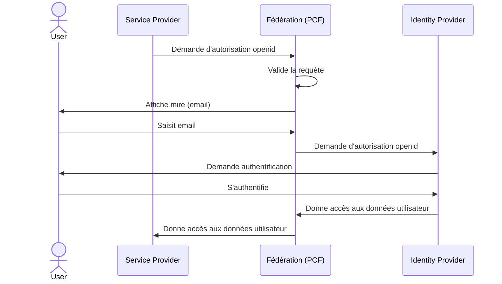

# Documentation ProConnect Fédération

D'un point de vue technique. La cinématique ProConnect Fédération (PCF) est divisée en deux parties principales distinctes:

1. Un échange openid entre le FI et PCF
2. Un échange openid entre PCF et le FS

Ces deux échanges ne sont cependant pas linéaires:

1. Le FS effectue une [demande d'autorisation openid](https://openid.net/specs/openid-connect-core-1_0.html#AuthorizationEndpoint) au endpoint PCF dédié. **# Début de l'échange entre le FC et le FS**
2. PCF valide que la requête est acceptable et affiche une mire où l'user doit entrer son email.
3. Le FI est automatiquement choisi selon l'email de l'user puis FC effectue une [demande d'autorisation openid](https://openid.net/specs/openid-connect-core-1_0.html#AuthorizationEndpoint) à l'endpoint dédié de ce FI. **# Début de l'échange entre le FI et PCF**
4. L'utilisateur s'authentifie sur le FI.
5. Le FI donne accès aux données de l'utilisateur à PCF. **# Fin de l'échange entre le FI et PCF**
6. PCF donne accès aux données de l'utilisateur au FS. **# fin de l'échange entre PCF et FS**

L'échange entre le FI et PCF est encapsulé dans l'échange entre PCF et le FS. Il faut garder en tête que cette représentation reste simplifiée car il existe en vérité d'autres étapes qui s'insèrent entre ces étapes. On garde cependant une bonne vision globale de ce qu'il se passe.

# Dépendances

## Sécurité des dépendances

_:warning: Les actions/contournements effectuées doivent régulièrement être mises à jour en fonction de l'évolution des dépendances_

Cette section reprend des rapports de checkmarx et yarn audit.

Elle indique les contres mesures qui ont dû être prises pour palier au problème remonté.

[Sécurité des dépendances](_doc/dépendances/sécurité/README.md).

# Codes erreurs des applications

Cette section fait le lien avec les codes erreurs des applications.

Voir [erreurs](_doc/erreurs.md).
