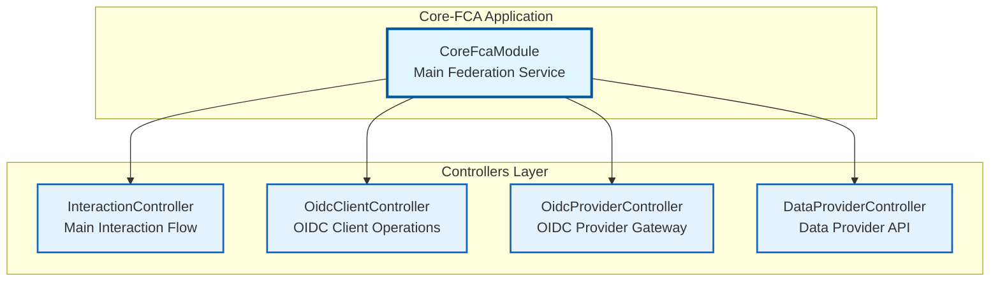
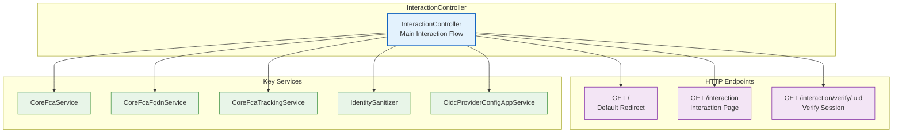
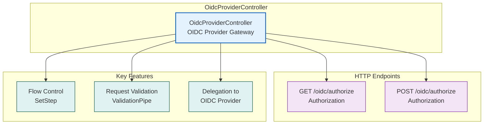
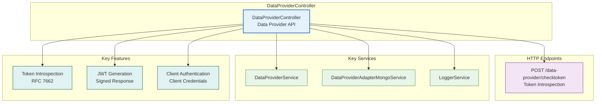
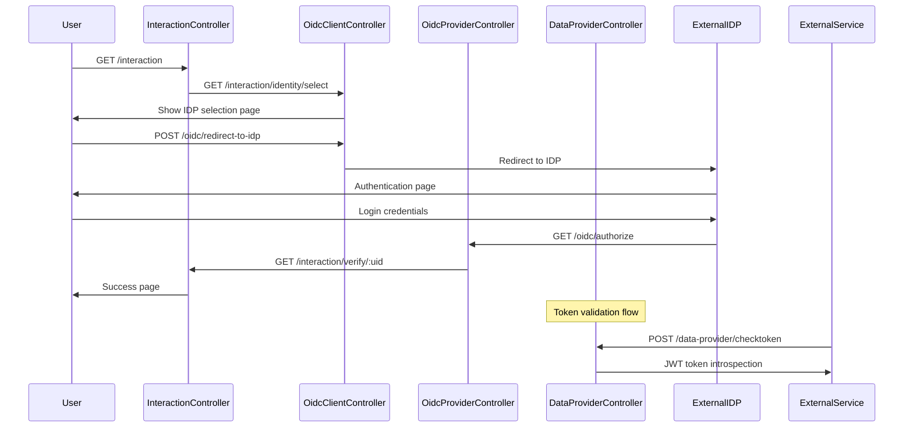

# Core-FCA Controllers Documentation

## Overview
This document provides a comprehensive overview of all controllers in the core-fca application, which is the main federation service for FranceConnect.

## 1. Controllers Overview

## 2. InteractionController - Endpoints & Flow

## 3. OidcClientController - Endpoints & Flow

```mermaid
graph TB
    subgraph "OidcClientController"
        OIDC_CLIENT_CTRL[OidcClientController<br/>OIDC Client Operations]
    end

    subgraph "HTTP Endpoints"
        GET_IDP_SELECTION["GET /interaction/identity/select<br/>IDP Selection"]
        POST_REDIRECT_IDP["POST /oidc/redirect-to-idp<br/>Redirect to IDP"]
        GET_WELL_KNOWN["GET /.well-known/jwks.json<br/>JWKS Endpoint"]
        GET_LOGOUT_IDP["GET /oidc/logout-from-idp<br/>Logout from IDP"]
        GET_REDIRECT_LOGOUT["GET /oidc/redirect-after-idp-logout<br/>Post Logout Redirect"]
        GET_OIDC_CALLBACK["GET /oidc/callback<br/>OIDC Callback"]
    end

    subgraph "Key Services"
        CORE_FCA_SERVICE[CoreFcaService]
        CORE_FCA_FQDN_SERVICE[CoreFcaFqdnService]
        IDENTITY_SANITIZER[IdentitySanitizer]
        ACCOUNT_SERVICE[AccountFcaService]
        OIDC_CLIENT_SERVICE[OidcClientService]
        EMAIL_VALIDATOR[EmailValidatorService]
    end

    OIDC_CLIENT_CTRL --> GET_IDP_SELECTION
    OIDC_CLIENT_CTRL --> POST_REDIRECT_IDP
    OIDC_CLIENT_CTRL --> GET_WELL_KNOWN
    OIDC_CLIENT_CTRL --> GET_LOGOUT_IDP
    OIDC_CLIENT_CTRL --> GET_REDIRECT_LOGOUT
    OIDC_CLIENT_CTRL --> GET_OIDC_CALLBACK

    OIDC_CLIENT_CTRL --> CORE_FCA_SERVICE
    OIDC_CLIENT_CTRL --> CORE_FCA_FQDN_SERVICE
    OIDC_CLIENT_CTRL --> IDENTITY_SANITIZER
    OIDC_CLIENT_CTRL --> ACCOUNT_SERVICE
    OIDC_CLIENT_CTRL --> OIDC_CLIENT_SERVICE
    OIDC_CLIENT_CTRL --> EMAIL_VALIDATOR

    classDef controller fill:#e3f2fd,stroke:#1565c0,stroke-width:2px
    classDef endpoint fill:#f3e5f5,stroke:#7b1fa2,stroke-width:1px
    classDef service fill:#e8f5e8,stroke:#388e3c,stroke-width:1px

    class OIDC_CLIENT_CTRL controller
    class GET_IDP_SELECTION,POST_REDIRECT_IDP,GET_WELL_KNOWN,GET_LOGOUT_IDP,GET_REDIRECT_LOGOUT,GET_OIDC_CALLBACK endpoint
    class CORE_FCA_SERVICE,CORE_FCA_FQDN_SERVICE,IDENTITY_SANITIZER,ACCOUNT_SERVICE,OIDC_CLIENT_SERVICE,EMAIL_VALIDATOR service
```

## 4. OidcProviderController - Endpoints & Flow

## 5. DataProviderController - Endpoints & Flow

## 6. Authentication Flow Sequence

## 7. Controller Dependencies

```mermaid
graph TB
    subgraph "Controllers"
        INTERACTION_CTRL[InteractionController]
        OIDC_CLIENT_CTRL[OidcClientController]
        OIDC_PROVIDER_CTRL[OidcProviderController]
        DATA_PROVIDER_CTRL[DataProviderController]
    end

    subgraph "Core Services"
        CORE_FCA_SERVICE[CoreFcaService]
        CORE_FCA_FQDN_SERVICE[CoreFcaFqdnService]
        CORE_FCA_TRACKING_SERVICE[CoreFcaTrackingService]
        DATA_PROVIDER_SERVICE[DataProviderService]
    end

    subgraph "External Libraries"
        OIDC_PROVIDER[OidcProviderService]
        OIDC_CLIENT[OidcClientService]
        SESSION[SessionService]
        TRACKING[TrackingService]
        CRYPTOGRAPHY[CryptographyService]
        CSRF[CsrfService]
        NOTIFICATIONS[NotificationsService]
    end

    INTERACTION_CTRL --> CORE_FCA_SERVICE
    INTERACTION_CTRL --> CORE_FCA_FQDN_SERVICE
    INTERACTION_CTRL --> CORE_FCA_TRACKING_SERVICE
    INTERACTION_CTRL --> OIDC_PROVIDER
    INTERACTION_CTRL --> SESSION
    INTERACTION_CTRL --> TRACKING
    INTERACTION_CTRL --> CSRF

    OIDC_CLIENT_CTRL --> CORE_FCA_SERVICE
    OIDC_CLIENT_CTRL --> CORE_FCA_FQDN_SERVICE
    OIDC_CLIENT_CTRL --> OIDC_CLIENT
    OIDC_CLIENT_CTRL --> SESSION
    OIDC_CLIENT_CTRL --> TRACKING
    OIDC_CLIENT_CTRL --> CRYPTOGRAPHY
    OIDC_CLIENT_CTRL --> CSRF

    OIDC_PROVIDER_CTRL --> OIDC_PROVIDER

    DATA_PROVIDER_CTRL --> DATA_PROVIDER_SERVICE

    classDef controller fill:#e3f2fd,stroke:#1565c0,stroke-width:2px
    classDef coreService fill:#e8f5e8,stroke:#388e3c,stroke-width:2px
    classDef external fill:#fff3e0,stroke:#f57c00,stroke-width:2px

    class INTERACTION_CTRL,OIDC_CLIENT_CTRL,OIDC_PROVIDER_CTRL,DATA_PROVIDER_CTRL controller
    class CORE_FCA_SERVICE,CORE_FCA_FQDN_SERVICE,CORE_FCA_TRACKING_SERVICE,DATA_PROVIDER_SERVICE coreService
    class OIDC_PROVIDER,OIDC_CLIENT,SESSION,TRACKING,CRYPTOGRAPHY,CSRF,NOTIFICATIONS external
```

## Controller Details

### 1. **InteractionController** - Main Interaction Flow

#### **Purpose**
Handles the main user interaction flow for FranceConnect authentication, including session management, identity provider selection, and user verification.

#### **Key Endpoints**
- **GET /** - Default redirect to configured default URI
- **GET /interaction** - Main interaction page for authentication flow
- **GET /interaction/verify/:uid** - Session verification endpoint

#### **Key Features**
- **Session Management**: Handles user sessions and session validation
- **Identity Provider Selection**: Manages IDP selection based on email domain
- **Flow Control**: Controls the authentication flow steps
- **Tracking**: Integrates with tracking service for analytics
- **CSRF Protection**: Implements CSRF token validation

#### **Dependencies**
- `OidcProviderService` - OIDC provider operations
- `OidcAcrService` - Authentication Context Class Reference
- `IdentityProviderAdapterMongoService` - IDP data access
- `ServiceProviderAdapterMongoService` - SP data access
- `ConfigService` - Configuration management
- `NotificationsService` - Notification handling
- `CoreFcaFqdnService` - FQDN-based routing
- `TrackingService` - Analytics tracking
- `SessionService` - Session management
- `CoreFcaService` - Core federation logic
- `CsrfService` - CSRF protection

### 2. **OidcClientController** - OIDC Client Operations

#### **Purpose**
Manages OIDC client-side operations including identity provider selection, redirects, callbacks, and logout flows.

#### **Key Endpoints**
- **GET /interaction/identity/select** - Identity provider selection page
- **POST /oidc/redirect-to-idp** - Redirect to selected identity provider
- **GET /.well-known/jwks.json** - JSON Web Key Set endpoint
- **GET /oidc/logout-from-idp** - Logout from identity provider
- **GET /oidc/redirect-after-idp-logout** - Post-logout redirect
- **GET /oidc/callback** - OIDC callback handling

#### **Key Features**
- **IDP Selection**: Handles identity provider selection based on email domain
- **Email Validation**: Validates user email addresses
- **FQDN Routing**: Routes users based on their email domain
- **Session Management**: Manages user sessions during OIDC flow
- **Tracking**: Tracks user interactions and events
- **CSRF Protection**: Implements CSRF token validation

#### **Dependencies**
- `AccountFcaService` - Account management
- `ConfigService` - Configuration management
- `LoggerService` - Logging
- `OidcClientService` - OIDC client operations
- `OidcClientConfigService` - OIDC client configuration
- `CoreFcaService` - Core federation logic
- `IdentityProviderAdapterMongoService` - IDP data access
- `SessionService` - Session management
- `TrackingService` - Analytics tracking
- `CryptographyService` - Cryptographic operations
- `EmailValidatorService` - Email validation
- `CoreFcaFqdnService` - FQDN-based routing
- `IdentitySanitizer` - Identity data sanitization
- `CsrfService` - CSRF protection

### 3. **OidcProviderController** - OIDC Provider Gateway

#### **Purpose**
Acts as a gateway for OIDC provider operations, handling authorization requests and delegating to the underlying OIDC provider service.

#### **Key Endpoints**
- **GET /oidc/authorize** - Authorization endpoint (GET)
- **POST /oidc/authorize** - Authorization endpoint (POST)

#### **Key Features**
- **Request Validation**: Validates incoming authorization requests
- **Flow Control**: Manages OIDC authorization flow steps
- **Delegation**: Delegates requests to underlying OIDC provider service
- **Parameter Validation**: Validates query parameters and body data

#### **Dependencies**
- `SetStep` - Flow step management
- `OidcProviderRoutes` - OIDC provider route definitions
- `AuthorizeParamsDto` - Authorization parameters validation

### 4. **DataProviderController** - Data Provider API

#### **Purpose**
Handles data provider operations, specifically token introspection for validating access tokens and providing token information.

#### **Key Endpoints**
- **POST /data-provider/checktoken** - Token introspection endpoint

#### **Key Features**
- **Token Introspection**: Validates access tokens and returns token information
- **JWT Generation**: Generates signed JWT responses for token introspection
- **Authentication**: Authenticates data providers using client credentials
- **Session Retrieval**: Retrieves sessions based on access tokens
- **Error Handling**: Implements custom exception filtering

#### **Dependencies**
- `LoggerService` - Logging
- `DataProviderService` - Data provider business logic
- `DataProviderAdapterMongoService` - Data provider data access
- `DataProviderExceptionFilter` - Custom exception handling

## Controller Relationships

### **Flow Control**
1. **InteractionController** → **OidcClientController** → **OidcProviderController**
2. **OidcProviderController** → External OIDC Provider Service
3. **DataProviderController** → Independent API endpoint

### **Data Flow**
1. **User Request** → **InteractionController** (session validation)
2. **IDP Selection** → **OidcClientController** (routing logic)
3. **Authorization** → **OidcProviderController** (OIDC flow)
4. **Token Validation** → **DataProviderController** (token introspection)

### **Session Management**
- All controllers integrate with `SessionService` for session management
- Session data flows through the entire authentication process
- Session validation occurs at multiple points in the flow

## Security Features

### **CSRF Protection**
- Implemented in `InteractionController` and `OidcClientController`
- Uses `CsrfService` for token generation and validation
- Protects against cross-site request forgery attacks

### **Input Validation**
- All controllers use `ValidationPipe` for request validation
- DTOs are used for parameter validation
- Whitelist validation prevents unwanted parameters

### **Session Security**
- Session duplication for cookie-theft mitigation
- Session reset and validation at key points
- Secure session storage with Redis

### **Token Security**
- JWT-based token introspection
- Signed responses for high-security scenarios
- Client authentication for data provider access

## Error Handling

### **Exception Filters**
- `DataProviderExceptionFilter` for data provider errors
- Custom exception classes for specific error scenarios
- Proper HTTP status codes and error responses

### **Validation Errors**
- Class-validator integration for DTO validation
- Detailed error messages for debugging
- Graceful error handling throughout the flow

## Performance Considerations

### **Caching**
- Cache control headers for appropriate endpoints
- Session caching with Redis
- Response optimization for frequently accessed endpoints

### **Database Optimization**
- Efficient queries through adapter services
- Connection pooling for database operations
- Optimized data retrieval patterns

---

*This documentation covers all controllers in the core-fca application as of the current codebase version.* 