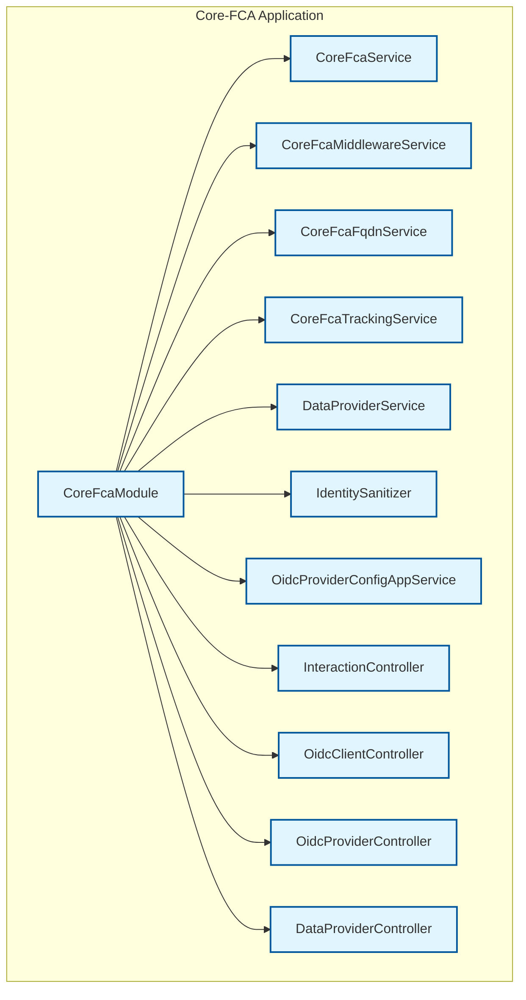
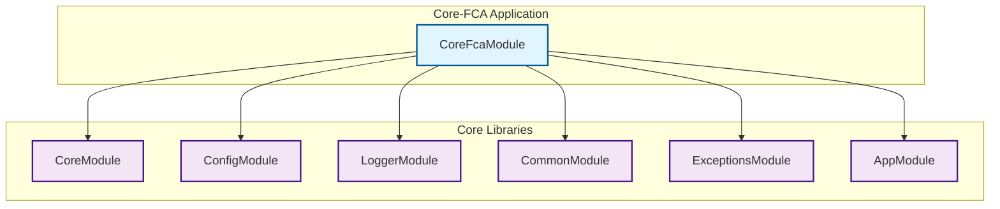
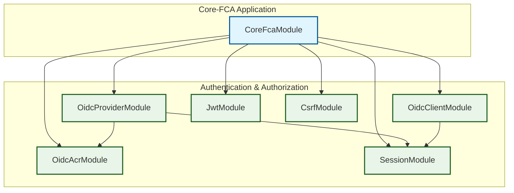
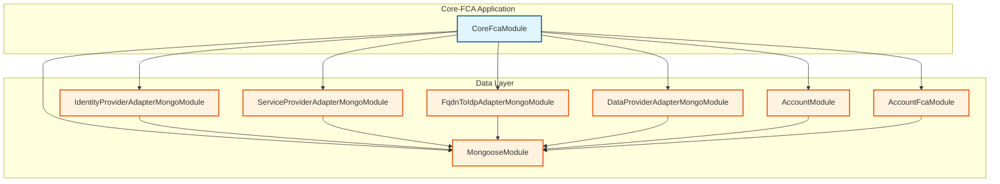
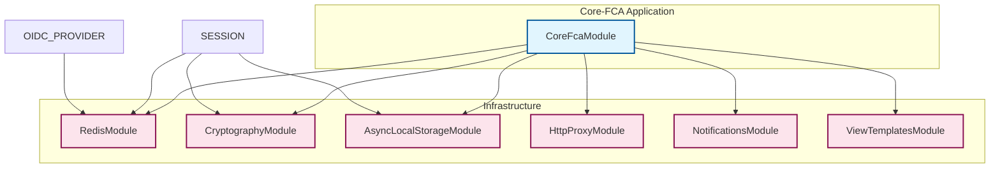
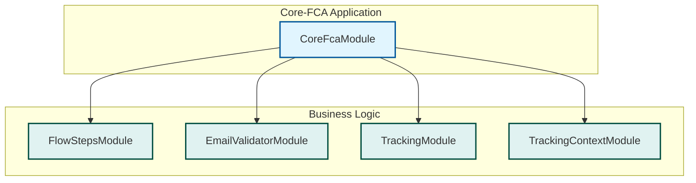
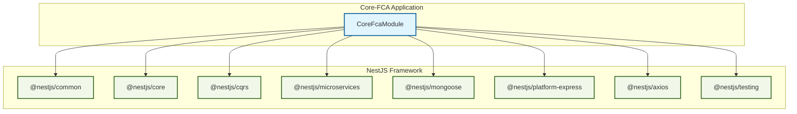
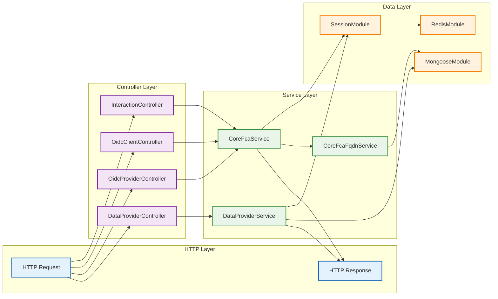
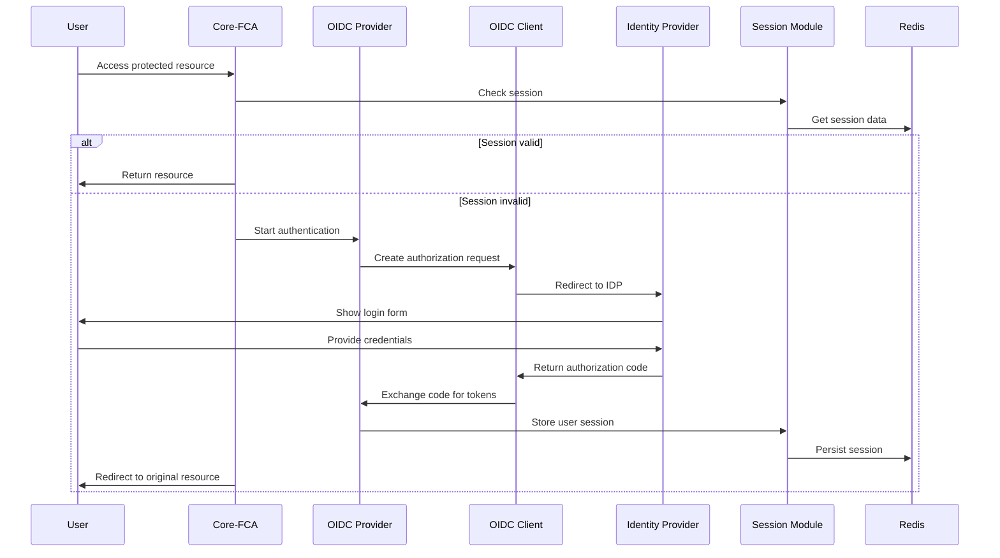

# Core-FCA Libraries Architecture Schema

## Overview
This document contains multiple focused diagrams showing the libraries and their relationships used in the core-fca application, which is the main federation service for FranceConnect.

## 1. Core-FCA Application Structure

## 2. Core Libraries Dependencies

## 3. Authentication & Authorization Libraries

## 4. Data Layer Libraries

## 5. Infrastructure Libraries

## 6. Business Logic Libraries

## 7. NestJS Framework Dependencies

## 8. Key Third-party Libraries

```mermaid
graph TB
    subgraph "Core-FCA Application"
        CFCA[CoreFcaModule]
    end

    subgraph "Key Third-party Libraries"
        EXPRESS[express]
        EXPRESS_SESSION[express-session]
        COOKIE_PARSER[cookie-parser]
        BODY_PARSER[body-parser]
        HELMET[helmet]
        OIDC_PROVIDER_LIB[oidc-provider]
        OPENID_CLIENT[openid-client]
        JOSE[jose]
        JOSE_OPENID_CLIENT[jose-openid-client]
        MONGOOSE_LIB[mongoose]
        IOREDIS[ioredis]
        PINO[pino]
        LODASH[lodash]
        UUID[uuid]
        AXIOS[axios]
        RXJS[rxjs]
        CLASS_VALIDATOR[class-validator]
        CLASS_TRANSFORMER[class-transformer]
    end

    CFCA --> EXPRESS
    CFCA --> EXPRESS_SESSION
    CFCA --> COOKIE_PARSER
    CFCA --> BODY_PARSER
    CFCA --> HELMET
    CFCA --> OIDC_PROVIDER_LIB
    CFCA --> OPENID_CLIENT
    CFCA --> JOSE
    CFCA --> JOSE_OPENID_CLIENT
    CFCA --> MONGOOSE_LIB
    CFCA --> IOREDIS
    CFCA --> PINO
    CFCA --> LODASH
    CFCA --> UUID
    CFCA --> AXIOS
    CFCA --> RXJS
    CFCA --> CLASS_VALIDATOR
    CFCA --> CLASS_TRANSFORMER

    %% Internal dependencies
    JWT --> AXIOS
    JWT --> JOSE

    classDef coreFca fill:#e1f5fe,stroke:#01579b,stroke-width:2px
    classDef thirdParty fill:#fafafa,stroke:#424242,stroke-width:1px

    class CFCA coreFca
    class EXPRESS,EXPRESS_SESSION,COOKIE_PARSER,BODY_PARSER,HELMET,OIDC_PROVIDER_LIB,OPENID_CLIENT,JOSE,JOSE_OPENID_CLIENT,MONGOOSE_LIB,IOREDIS,PINO,LODASH,UUID,AXIOS,RXJS,CLASS_VALIDATOR,CLASS_TRANSFORMER thirdParty
```

## 9. Data Flow Architecture

## 10. Authentication Flow

## Key Components Description

### Core-FCA Application
- **CoreFcaModule**: Main application module that orchestrates all services
- **Services**: Business logic services for federation operations
- **Controllers**: HTTP endpoints for OIDC interactions

### Core Libraries
- **CoreModule**: Core federation functionality
- **ConfigModule**: Configuration management
- **LoggerModule**: Logging services
- **CommonModule**: Shared utilities and helpers
- **ExceptionsModule**: Exception handling
- **AppModule**: Application-level configuration

### Authentication & Authorization
- **OidcProviderModule**: OIDC provider implementation
- **OidcClientModule**: OIDC client functionality
- **OidcAcrModule**: Authentication Context Class Reference
- **JwtModule**: JWT token handling
- **CsrfModule**: CSRF protection
- **SessionModule**: Session management

### Data Layer
- **MongooseModule**: MongoDB connection and schemas
- **AccountModule**: User account management
- **AccountFcaModule**: FranceConnect specific account features
- **IdentityProviderAdapterMongoModule**: IDP data adapter
- **ServiceProviderAdapterMongoModule**: SP data adapter
- **FqdnToIdpAdapterMongoModule**: FQDN to IDP mapping
- **DataProviderAdapterMongoModule**: Data provider adapter

### Infrastructure
- **RedisModule**: Redis caching and session storage
- **CryptographyModule**: Cryptographic operations
- **AsyncLocalStorageModule**: Async context storage
- **HttpProxyModule**: HTTP proxy functionality
- **NotificationsModule**: Notification services
- **ViewTemplatesModule**: Template rendering

### Business Logic
- **FlowStepsModule**: Step-by-step flow management
- **EmailValidatorModule**: Email validation
- **TrackingModule**: User tracking and analytics
- **TrackingContextModule**: Tracking context management

## Data Flow

1. **Request Flow**: HTTP requests → Controllers → Services → Libraries
2. **Authentication Flow**: OIDC Provider → OIDC Client → Identity Providers
3. **Data Flow**: Services → Data Adapters → MongoDB/Redis
4. **Session Flow**: Session Module → Redis → Async Local Storage
5. **Validation Flow**: DTOs → Class Validator → Class Transformer

## Security Features

- **CSRF Protection**: Cross-site request forgery prevention
- **JWT Tokens**: Secure token-based authentication
- **Session Management**: Secure session handling with Redis
- **Cryptography**: Encryption and signing operations
- **Input Validation**: Comprehensive DTO validation

---

*This document was automatically generated based on the analysis of the core-fca application dependencies and architecture.* 