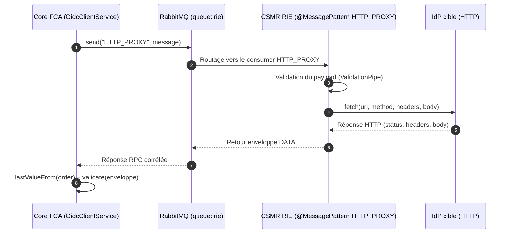
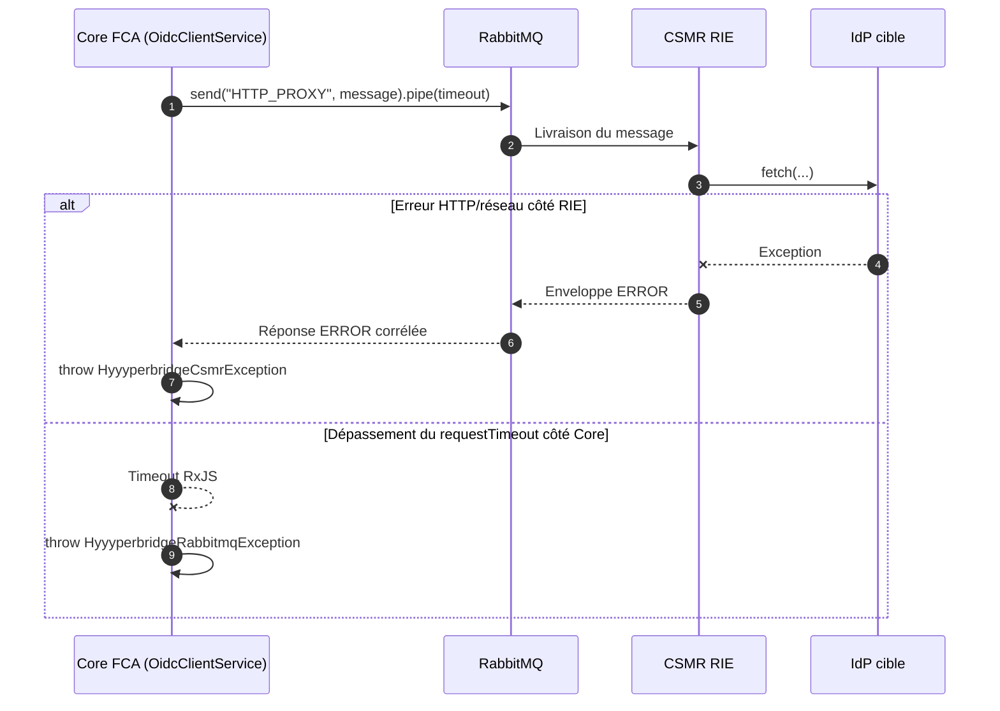

# Hyyyperbridge

## Objectif

Pour permettre à des utilisateurs sur Internet disposant d'un accès au RIE d'accéder à des fournisseurs d'identité (FI) accessibles uniquement depuis le réseau RIE, la passerelle Hyyyperbridge met en place une rupture protocolaire.

L’application Fédération (côté Internet) envoie une requête RPC via RabbitMQ. Le consumer RIE reçoit cette requête, exécute l’appel HTTP vers le FI côté RIE, puis renvoie la réponse.

## Principe de fonctionnement

- Côté émetteur : `send("HTTP_PROXY", message)` envoie une requête RPC.
- Côté consumer : `@MessagePattern("HTTP_PROXY")` traite la requête.
- Côté transport : RabbitMQ achemine la requête vers la queue métier `rie`.
- Côté réponse : Nest/RabbitMQ gèrent automatiquement la corrélation.

## Séquence nominale

## Séquence en erreur (timeout / exception)

## Notes d'architecture

- L'utilisation de Hyyyperbridge implique une instance **Fédération Internet** + un **consumer côté RIE**.
- **L'instance Fédération RIE n'est pas impliquée** dans ce flux.
