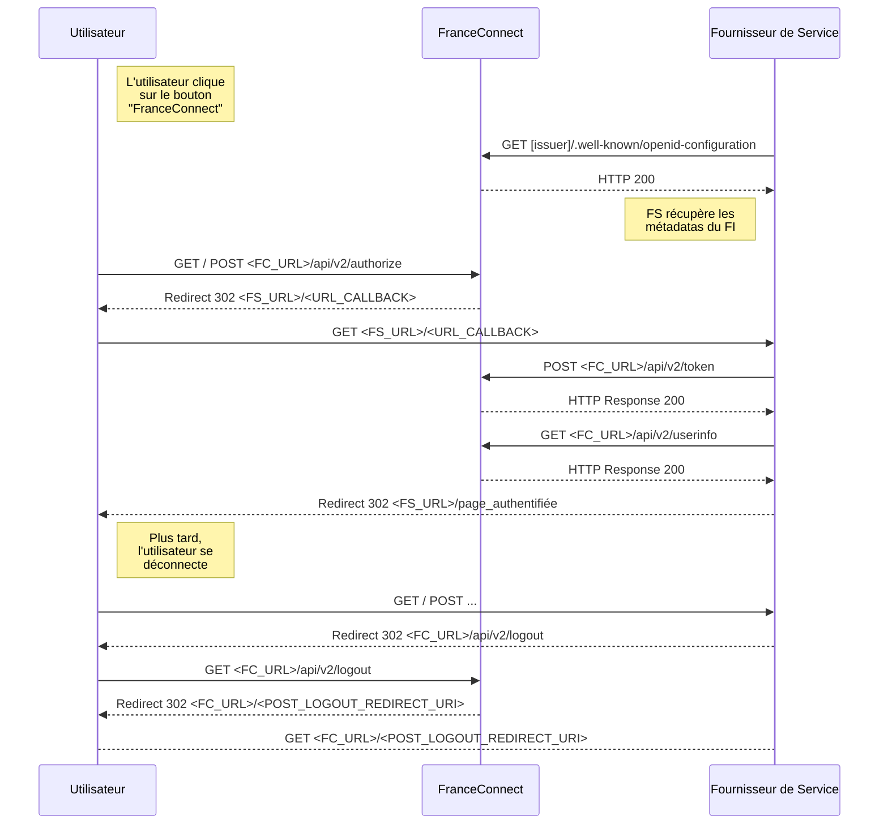

### Détail du fonctionnement

Le diagramme de flux représente entre l'utilisateur, FranceConnect+ et votre service est le suivant.

La récupération de l'identité pivot doit être faite dans la suite immédiate des appels précédents (authentification et récupération du code). Le fait d'appeler ce Web service plus tard n'est aujourd'hui pas proposé.
